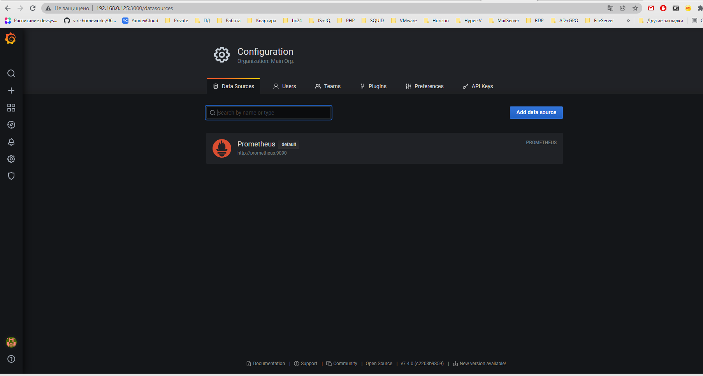
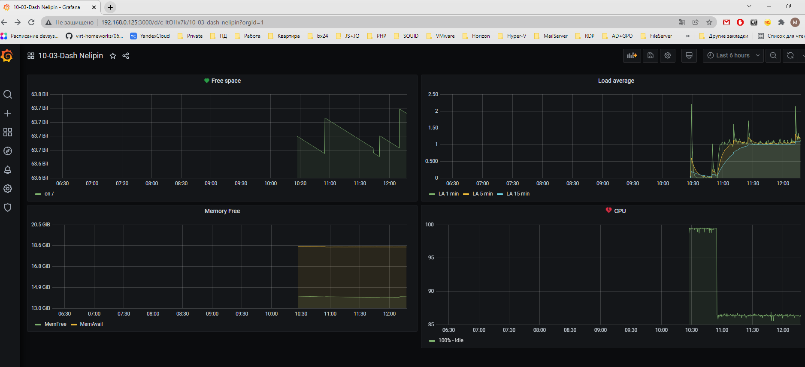
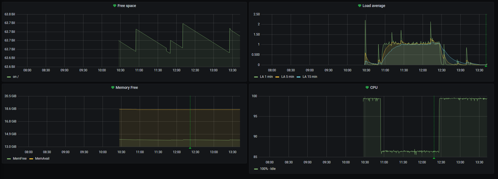

#1

#2

- Утилизация CPU для nodeexporter (в процентах, 100-idle) 

**avg (rate(node_cpu_seconds_total{instance="nodeexporter:9100", job="nodeexporter", mode="idle"}[10s]) * 100)**

- CPULA 1/5/15

**node_load1{instance="nodeexporter:9100", job="nodeexporter"}**
**node_load5{instance="nodeexporter:9100", job="nodeexporter"}**
**node_load15{instance="nodeexporter:9100", job="nodeexporter"}**

- Количество свободной оперативной памяти

**avg_over_time (node_memory_MemFree_bytes{instance="nodeexporter:9100", job="nodeexporter"}[20s])**

- Количество места на файловой системе

**node_filesystem_free_bytes{instance="nodeexporter:9100", job="nodeexporter", mountpoint="/"}**

#3

